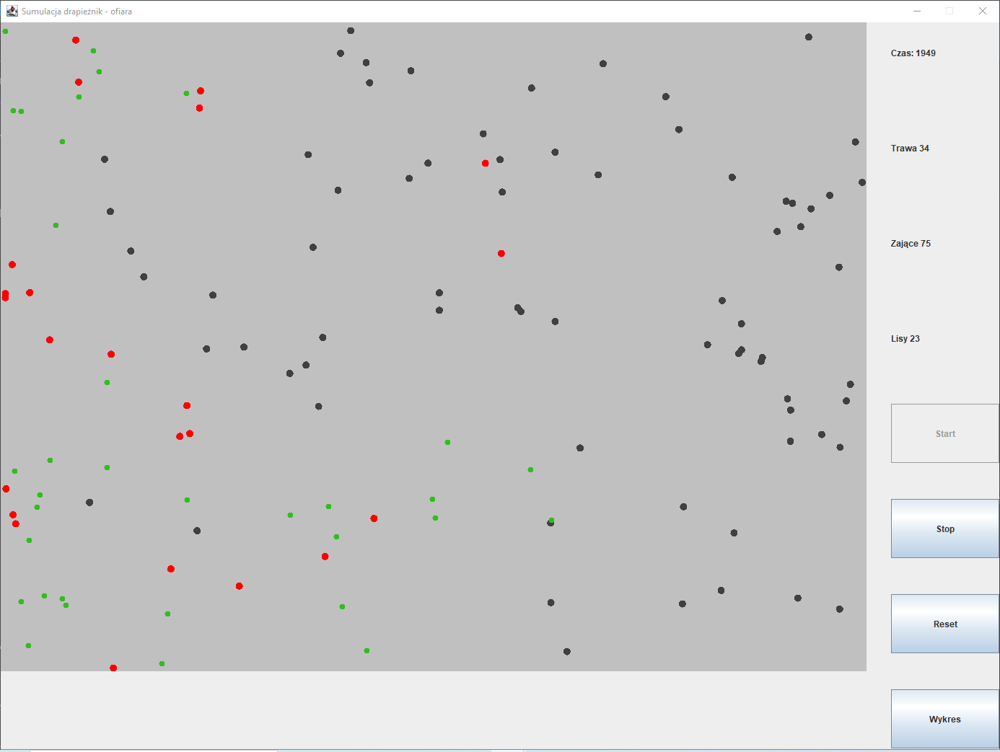
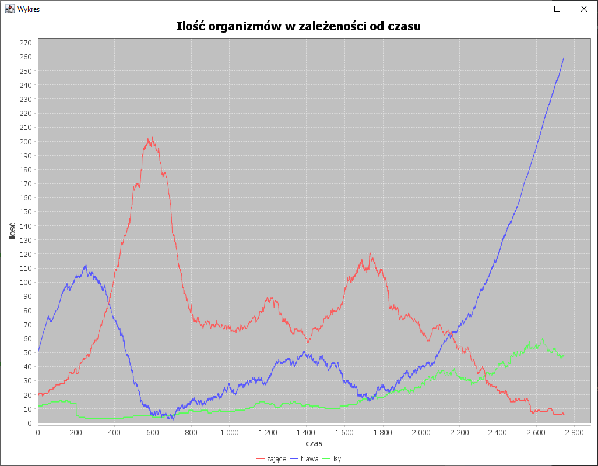

# Predator-Prey Simulation

## General Information
Inspired by Alfred Lotka (1910) and Vito Volterra (1926) - predator-prey model.

There are 3 organisms in the simulation: grass, hares and foxes. The grass appears in random places. The hares run away
from the foxes, and if they are hungry, they eat the grass. Foxes are chasing hares.

## Screenshots
### Program

### Chart

## Technologies Used
- Java
- Swing
- Maven
- JFreeChart - version 1.5.2

## Features
- Simulation time
- Customizable init amount of grass
- Customizable init amount of hares
- Customizable init amount of foxes
- Start button
- Stop button
- Reset button
- Showing the chart live

### Functions of grass
- They appear in a random place

### Functions of hares
- They run away from the foxes
- They eat grass
- Reproduction

### Functions of hares
- They eat hares
- Reproduction

## Usage
Run main method in Run class.

## Room for Improvement
- Adding a scavenger
- Configurable grass growing speed
- Configurable map size
- Unique max speed for each rabbit and fox
- Unique visibility for each rabbit and fox
- Inheriting visibility and max speed from parents